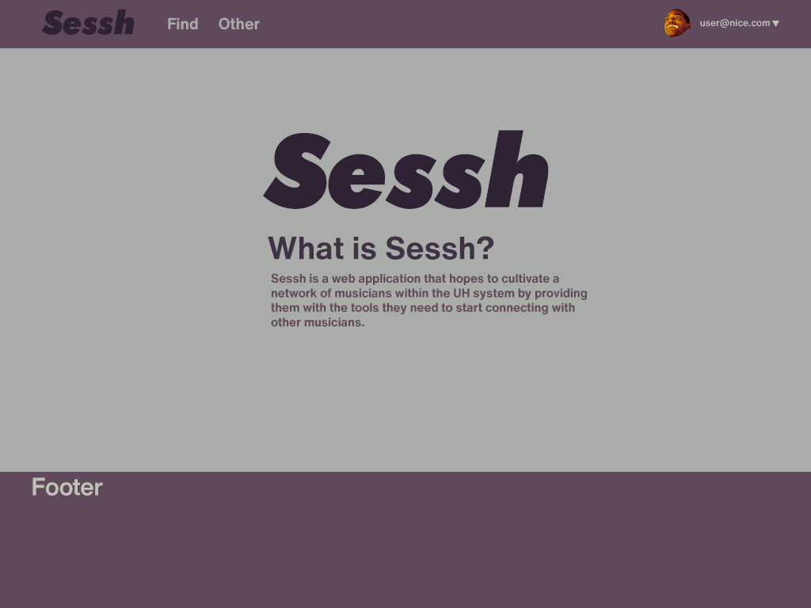
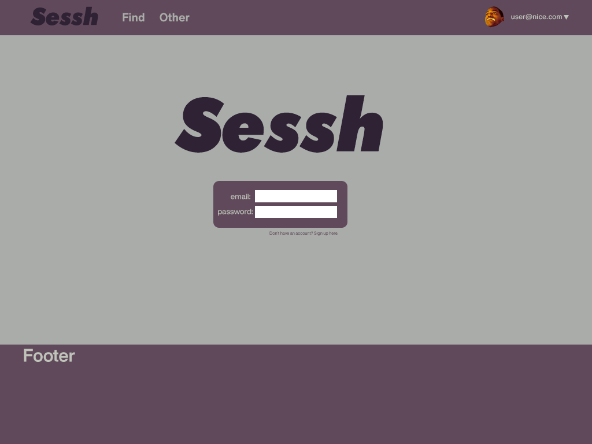
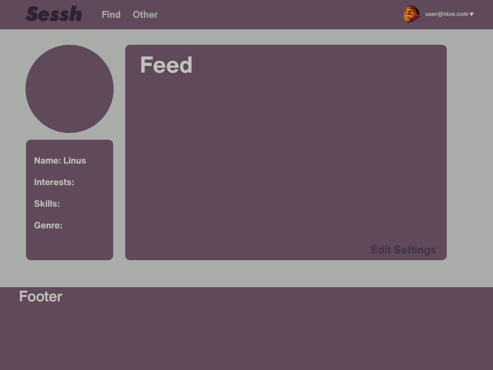
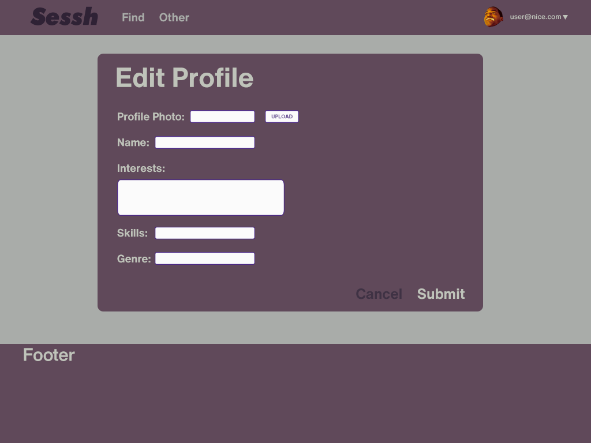
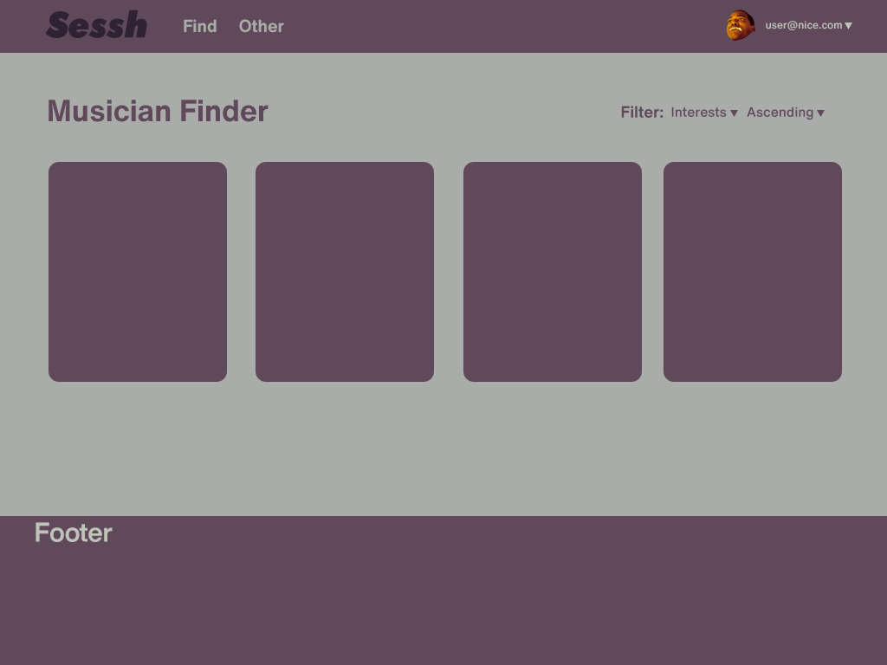

This page documents Mox Amber's project: Sessh. The site is updated regularly
as the project is still in development.

## Table of Contents

* [Overview](https://mox-amber.github.io/sessh/#overview)
* [Deployment](https://mox-amber.github.io/sessh/#deployment)
* [User Guide](https://mox-amber.github.io/sessh/#user-guide)
* [Developer Guide](https://mox-amber.github.io/sessh/#developer-guide)
* [Development](https://mox-amber.github.io/sessh/#development)

## Overview
Sessh is a web application that hopes to cultivate a network of musicians
within the UH system by providing them with the tools they need to start
muscician-to-musician connections. By using simple and effective design 
principals we aim to have an application with the following features:

* Creation of profiles including descriptions such as musical interests, goals, skills, etc.
* Profiles will contain access to musical works they produced with links to other work they
  were involved in.
* Search features that allow filtering based on preferences.
* Adding people to your regular sessions list.
* Notifications based on search terms.

## Deployment
If you would like to see our application in action you can visit [our live site]().

## User Guide
The following is a walkthrough of the application.

### Landing Page
When visiting the site, a user is greeted with our landing page describing the
purpose of the application. 

A user can sign in by clicking the link in the upper right corner.

### Sign In
When signing in the user is taken to the sign in page where they can enter their
information.

### User Dashboard
After signing in the user is taken to their dashboard where they can view people
within their network and edit their profile.

### Edit Profile
If the user wants to update or change their account, they will be taken to their
edit profile page.

### Find Page
The find page lets users discover and filter musicians based on their preferences.

## Developer Guide
[TODO]

## Development
To bring our application to life we used issue driven management practices through 
our github repository. Within the repository separate projects were created based
on milestones we expected to reach. Our milestones were then divided into issues 
divided amongst each member.

### Milestone 1
For milestone 1, our goal was to create and deploy a working version of our application.

You can view our [project board](https://github.com/mox-amber/sessh/projects/1)
if you would like to see how we divided our tasks.

### Milestone 2
[TODO]

