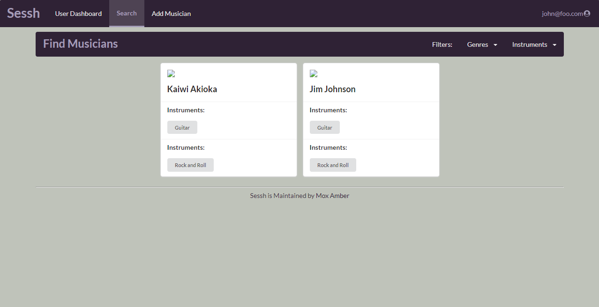
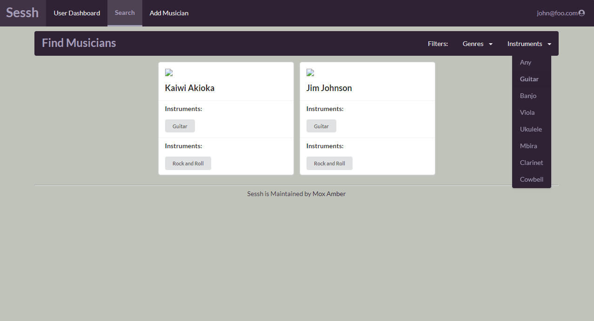

This page documents Mox Amber's project: Sessh. The site is updated regularly
as the project is still in development.

## Table of Contents

  * [Overview](https://mox-amber.github.io/sessh/#overview)
  * [Deployment](https://mox-amber.github.io/sessh/#deployment)
  * [User Guide](https://mox-amber.github.io/sessh/#user-guide)
  * [Developer Guide](https://mox-amber.github.io/sessh/#developer-guide)
  * [Development](https://mox-amber.github.io/sessh/#development)

## Overview
### What Is Sessh?
Let's say you need a drummer for your band, looking for someone to teach you how to learn
certain chord pattern, or just want some people to jam with. Finding other
individuals who wish to pursue musical related goals can be difficult, especially
when there is no reliable resource to do so. That's were Sessh comes in, we hope
to develop a web application dedicated to cultivating a network of students who are musically inclined and enrolled at a University of Hawaii affiliated school.

### How Will it Work?
We are aiming to provide the fundamental tools necessary to bring students together
so that they can arrange organized meet ups for anyone interested. We will first start with a CRUD(create, read, update, and delete) based design for our initial tools including:
* Creation of profiles including descriptions such as musical interests, goals, skills, etc.
* Profiles will contain access to musical works they produced with links to other work they
  were involved in.
* Full browsing with dedicated filtering capabilities where a user can search for others based on information listed on their profiles.
* Adding people to your regular sessions list.
* Notifications based on search terms.

Along with the feature suite, there will be a dedicated group of 'super-users' with admin
capabilities that ensure the website adheres to our applications policy.

## Deployment
If you would like to see our application in action you can visit [our live site](http://161.35.230.24/#/).

## User Guide
The following is a walkthrough of the application.

### Landing Page
When visiting the site, a user is greeted with our landing page describing the
purpose of the application. 

A user can sign in by clicking the link in the upper right corner.

### Sign In
When signing in the user is taken to the sign in page where they can enter their
information.

### User Dashboard
After signing in the user is taken to their dashboard where they can view people
within their network and edit their profile.

### Edit Profile
If the user wants to update or change their account, they will be taken to their
edit profile page.

### Find Page
The find page lets users discover and filter musicians based on their preferences.

## Developer Guide
# Download to local machine
Using [github repository](https://github.com/mox-amber/sessh), click on Code to clone the repository into Github Desktop. This will open up Github Desktop and allow you to view the repository in your local machine. 

# Editing
Open your editor (ex. IntelliJ Idea) and create a new web project. Link your project to the file containing your repository and the project files will be displayed into your editor. 
For any modifications, create a new branch (DO NOT make edits in the master branch) and create your changes. 

# Deployment
To deploy, run meteor npm install and then meteor npm run start into the command prompt. You will get a link to copy and open into your web browser. This will allow you to view any changes that you have made locally. Once you are satisfied with your changes, push your branch into Github and the changes will be checked before merging into the master branch. 

## Development
To bring our application to life we used issue driven management practices
through the sessh [github repository](https://github.com/mox-amber/sessh). Within the repository separate projects were created based on milestones we expected to reach. Our milestones were then divided into issues divided amongst each member.

The Mox Amber team signed a contract that outlined the expectations of each member. You can view a copy of our team contract here: [Team Contract](https://docs.google.com/document/d/1PoUwM7omjHm2AsQrFtHgtw8QwC63vHkxEemNF_xnBQQ/edit).

### Milestone 1
For milestone 1, our goal was to create and deploy a basic working version of our application.

You can view our [project board](https://github.com/mox-amber/sessh/projects/1)
if you would like to see how we divided our tasks.

### Milestone 2
For milestone 2, our goal now is to add the functionalities that we were unable to add in milestone 1. That, and also to make our application look better in general.

You can view our [project board](https://github.com/mox-amber/sessh/projects/2)
if you would like to see how we divided our tasks.

## The Team
* Kaiwi Akioka
* Edward Birtodaso
* Josh Constantino
* Waylon Ho
* Ian Iwata

For further information about Mox Amber and our projects you can visit our [github](https://github.com/mox-amber).

